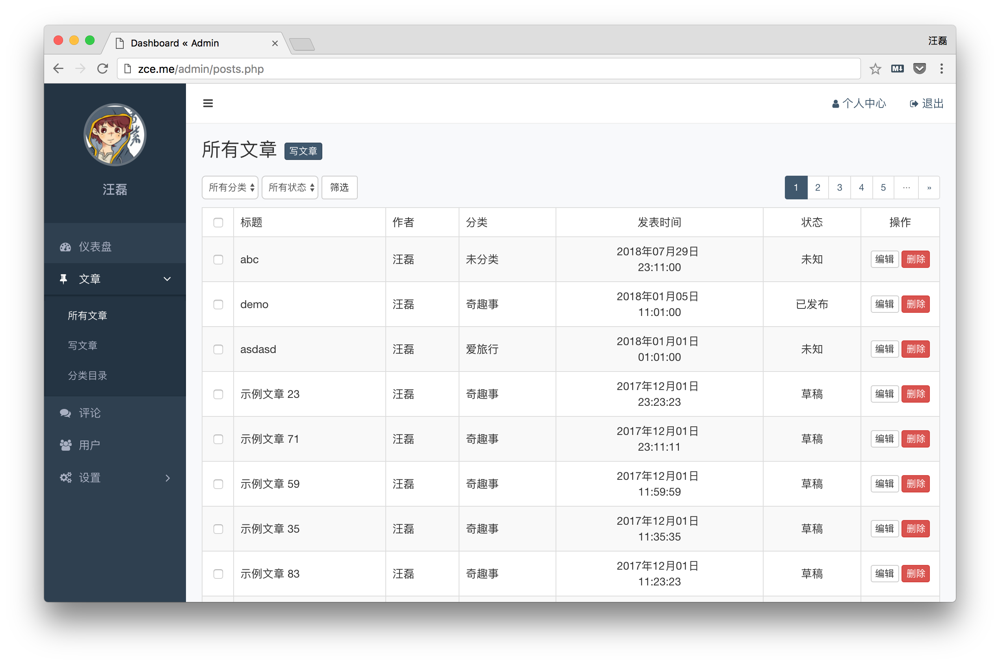
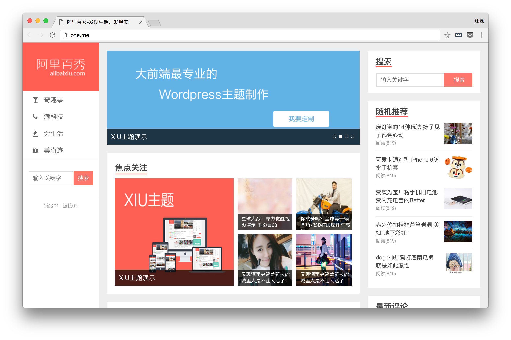

# 项目简介

## ！！！申明！！！

技术本没有难与不难之分，所有在你耳边说这个什么难那个什么难的人，肯定自己也都不咋地，只要不带着主观/惯性思维，就没有问题，不要被一切纸老虎吓倒了！

### 核心目标

- 了解 Web 开发过程（历史）
- 掌握基本的动态网站开发
- 培养 B/S 架构应用开发思维
- 锻炼 JavaScript jQuery AJAX

---

## 项目预览演示

> 一个自媒体信息发布平台

### 管理员（编辑）通过网站后台管理界面管理（发布、维护）自媒体内容

- 用户登录
  + 登录界面可以根据是否填写表单内容拒绝登录操作
  + 管理员可以通过用户名和密码登录到后台
- 内容管理
  + 管理员可以通过管理后台查看全部内容
  + 管理员可以通过管理后台增加内容
  + 管理员可以通过管理后台删除内容
  + ~~管理员可以通过管理后台修改内容~~
- 分类管理
  + 管理员可以通过管理后台查看全部分类
  + 管理员可以通过管理后台增加分类
  + 管理员可以通过管理后台删除分类
  + 管理员可以通过管理后台修改分类名称
- 评论管理
  + 管理员可以通过管理后台查看全部评论
  + 管理员可以通过管理后台审核评论
  + 管理员可以通过管理后台删除评论
- 用户管理
  + 管理员可以通过管理后台查看全部用户
  + 管理员可以通过管理后台增加用户
  + 管理员可以通过管理后台删除用户（不能删除当前登录用户）
  + ~~管理员可以通过管理后台禁用用户~~
- 网站设置
  + 管理员可以通过管理后台维护侧边导航的菜单
  + 管理员可以通过管理后台维护首页轮播
  + 管理员可以通过管理后台维护推荐位展示

### 用户可以通过网站前台查看内容

- 公共模块
  + 通过左侧边栏导航菜单访问不同分类内容
  + 通过右侧边栏搜索框搜索指定关键词的内容
  + ~~通过右侧边栏查看随机推荐内容~~
  + ~~通过右侧边栏查看广告（广告位）~~
  + 通过右侧边栏查看最新的评论内容
  + 通过页脚区域的展示了解网站相关信息
- 首页
  + 通过首页查看最新推荐位内容
  + 通过首页查看一周热门内容，并可以为每一条内容点赞
  + 通过首页查看最新发布内容
  + ~~通过首页查看编辑推荐内容~~
  + ~~通过滚动触发加载当前界面上需要显示的图片~~
- 列表页
  + 通过列表页查看不同分类下的内容
  + ~~通过列表页滚动到底部查看早期发布的内容~~
  + 通过列表页的点赞按钮为不同内容点赞
- 详细页
  + 通过详细页查看不同文章相关信息（所属分类、发表时间、作者、阅读次数、评论次数）
  + 通过详细页查看不同文章具体的详细内容
  + 通过详细页的点赞按钮为不同文章点赞
  + 通过详细页分享链接将当前文章分享到不同的社交媒体
  + 通过详细页访问当前文章的上一篇和下一篇文章
  + 通过详细页分页查看不同文章的评论列表
  + ~~通过详细页查看当前文章的相关推荐文章~~
  + 通过详细页给不同文章提交评论

---

## 功能点分析

<!-- TODO: 大体分析每一个功能点的实现思路 -->

---

## 课程安排介绍

<!-- TODO: 我们讲哪些模块，为什么 -->

---

## 动态网站的缘由

<!-- 引导大家接受动态网站开发，接受服务端开发，逐步掌握网站开发（B/S 架构）思维，并了解其重要性 -->

所谓的动态网站，指的是数据层面的动，并不是页面视觉层面的动。如果只是视觉层面的动，就根本不需要 PHP 这一类动态网站开发技术，静态页面就可以完成了。

所以我们必须要有一个数据源头，当每次请求到特定的 PHP 文件（或者是其他的动态网站开发技术），通过 PHP 脚本执行代码，获取数据库中最新的数据，然后动态组织（生成）一个 HTML 页面（可以理解为字符串拼接操作）。

**以上就是动态网站的本质**，目前来说，市面上的网站绝大多数都是动态网站。

---

## 开发流程简介

了解了动态网站的概念过后，我们作为开发者更多想到的就是如何具体开发一个动态网站应用程序，有那些具体的工作，流程是怎样的？

正常情况下，我们大概会有如下几个阶段：

<!-- 从无到有的大致过程 -->

1. **需求分析**：分析我们这个应用程序到底要去做哪些功能，应对哪些业务。
2. **原型设计**：根据需求分析的结果规划应用程序的原型，可以理解为“打草稿”（花不了太多的时间，收效是很大的）。
3. **UI 设计**：将“草稿”转换为设计稿，并提供相应的产物（设计稿、静态页面）。
4. **技术选型**：根据业务场景分别选择对应的技术栈（数据库技术栈、后端技术栈、前端技术栈），一般考虑的因素：人、业务。
5. **数据库设计**：根据需求和原型分析我们有哪些类型的数据需要存，从而得到我们数据库的基本结构。
6. **项目架构设计**：俗称搭架构，其中具体的操作主要就是制定项目规范约束、创建基本的项目结构、编写基础的公共模块代码和组织代码。
7. **业务迭代开发**：开发者的日常，基于项目架构（条条框框）下完成各项业务功能。
8. **集中测试**：将所有功能模块整合到一起过后，集中测试业务功能是否有 BUG，是否满足需求。
9. **部署上线**：从开发环境向生产环境转换，就是把应用部署到服务器上。

<!-- 重点介绍与开发者相关的内容 -->
