# 服务端开发基础

## 建立你的第一个网站（目标）

> **前端开发** 最终还是属于 **Web 开发** 中的一个分支，想要成为一名合格的前端开发人员，就必须要 **充分理解 Web 的概念**。

构建一个专业的网站是一项巨大的工作！对于新手我们应该从小事做起，也就是说咱们不可能立马就要求自己能够开发出跟淘宝一样的电商平台，但是对咱们来说建立一个属于自己的 Blog 网站并不难（其实再大的系统也是由一些基础功能叠加出来的），所以咱们就从这个话题开始聊。

## 如何建立一个 Blog 网站

> 提问：到底什么是网站？
>
> - 可以在浏览器上通过一个地址直接访问使用
> - 用于提供一种（或多种）特定服务的一系列具备相关性的网页组合的整体
> - 例如：博客、门户、电商、在线教育等

有了明确的目标过后，我们需要规划具体的业务方案，学习特定的技能，完成各项功能，解决各种过程中出现的问题。

```flow
s=>start: 开始
o1=>operation: 明确业务
o2=>operation: 根据分析需求
o3=>operation: 设计功能
o4=>operation: 具体实现功能
o5=>operation: 部署上线
e=>end: 结束
s->o1->o2->o3->o4->o5->e
```


### 之前学习了什么？

在之前的学习过程中，我们很专注，没有关心这些东西在整体中是什么角色，起到什么作用。这里我们是时候总结一下我们之前学过了的内容：

- 网页开发技术（硬性）
  - HTML —— 网页内容结构（GUI）
  - CSS —— 网页外观样式（GUI）
  - JavaScript —— 编程语言（**可以用于**调用浏览器提供的 API）
  - Web APIs —— 网页交互（界面功能）
  - jQuery —— 便捷手段（糖果而已，不是必要的）
- 编程能力 / 编程思想 / 解决问题的思路（软性）
  - 我要做什么（我要得到什么），我目前有什么（我能拿到什么）

至此，我们已经可以独立完成网页开发了，具体能完成的东西就是一个一个的网页，而且还能给这个页面加上一些动态的交互。但是这距离成为一个网站还有一些路要走。

```flow
webpage=>operation: 网页开发
website=>operation: 网站开发
application=>operation: 应用开发

webpage(right)->website(right)->application
```

### 还需要学习什么？

想要完成完整的 Web 网站，还需要学习什么？

- 搭建 WEB 服务器（提供网站服务的机器）
- HTTP（浏览器与服务端的通讯协议）
- 服务端开发（动态网页技术）
- 数据库操作（服务端存储数据方式）
- AJAX（浏览器与服务端的数据交互方式）

## 搭建 Web 服务器

> - 服务器（提供服务）指的就是一台**安装特定的软件的公共计算机**，用于专门用于提供特定的服务。
>   - 按照服务类型的不同，又划分为：Web 服务器、数据库服务器、文件服务器等等。
> - 客户端（使用服务）指的是在一次服务过程中使用这个服务的设备（网络端点）。
>   - 目前咱们最常见的客户端就是浏览器

我们手头上的这些网页，如果想要成为一个网站，首先要完成的第一件事就是有一台公共的 Web 服务器，把这一系列的页面放到这台 Web 服务器上，让用户可以通过服务器的地址访问到这些网页。


> 思考：为什么不把这些网页放在我们自己电脑上呢？

那么，哪里有这样的服务器呢？

我们手头上的电脑都可以是一台服务器，因为服务器是一个相对的概念，只要能提供服务就可以是一个服务器（提供服务的时候就是服务端，使用服务的时候就是客户端）。

既然服务器就是安装特定的软件的计算机，那么要让自己的成为 Web 服务器就是要安装一个 Web 服务器软件。

### Web 服务器软件

- Nginx ········································ 反向代理
- Apache ····································· PHP
- IIS ·············································· ASP.NET
- Tomcat  ····································· Java

### 安装 Web 服务器软件

这里我们选择一个比较常用的 Web 服务器软件：Apache HTTP Server。

> 如果使用的是安装版，与其他软件相同，安装无外乎就是一路点下一步，只是需要注意安装目录路径中不要有中文。

由于最新的 Apache 已经不提供 Windows 的安装版本了，所以我们这里使用的是解压版。

> - 下载地址：https://www.apachelounge.com/download/
> - 使用说明：https://httpd.apache.org/docs/current/platform/windows.html

安装方式如下，先解压到纯英文路径的文件夹，然后执行以下命令：

```shell
# 注意：需要使用管理员身份运行命令行！！！
# 切换到 Apache 解压路径中的 bin 目录
$ cd <解压目录>/bin
# 安装 Apache 服务，-n 参数是指定服务名称
$ httpd.exe -k install -n "Apache"
# 如果需要卸载 Apache，可以执行以下命令
$ httpd.exe -k uninstall -n "Apache"
```

执行安装命令过后会报一个错，原因是默认的配置文件有问题，需要先调整一下配置文件 `conf/httpd.conf`，才能正常启动服务。

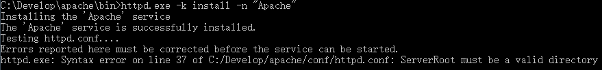

找到 Apache 解压目录中的 conf 目录下的 httpd.conf 文件，定位到 37 行，将 `c:/Apache24` 改为解压目录，我这里解压到路径是 `C:/Develop/apache`，所以我这里修改

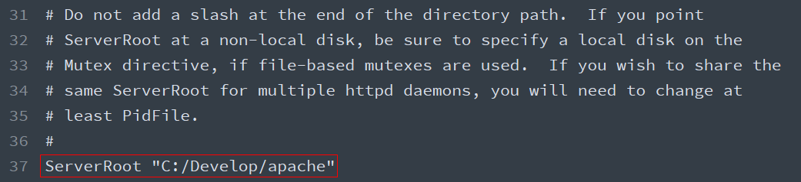

修改完以后，执行以下命令重新测试配置文件是否通过。

```shell
$ httpd.exe -t
```

这里任然报错：

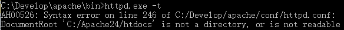

通过错误信息得知，这里是因为另外一个地方配置的目录不存在导致的，所以接着调整 246 行的 `DocumentRoot` 选项：

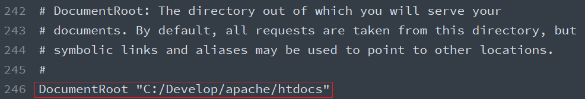

随即，我们发现这个配置文件中有很多默认配置选项中的路径都是 `c:/Apache24`，所以我们批量都修改为我们解压的目录路径。

然后重新执行 `httpd.exe -t` 测试配置文件，这时候应该提示 `Syntax OK`。

> 如果有关于 `ServerName` 的警告提示，不用管它，暂时还不会影响我们接下来的使用和操作。

接着运行以下命令重新启动 Apache 服务：

```shell
# 注意：需要使用管理员身份运行命令行！！！
$ httpd.exe -k start -n "Apache"
# 重新启动 Apache 服务
$ httpd.exe -k restart -n "Apache"
# 停止 Apache 服务
$ httpd.exe -k stop -n "Apache"
```

回到浏览器中，地址栏输入：http://localhost/，回车访问，这时正常应该看到 `It works!`

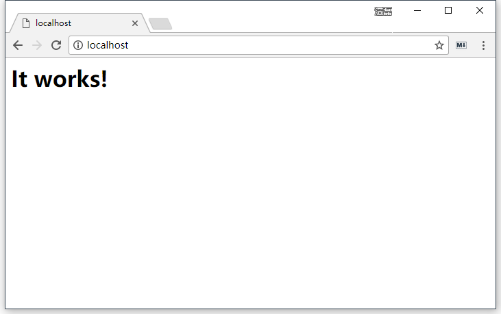

### 提供 Web 服务

启动 Apache，让别人可以使用你机器上安装的 Apache 提供的 Web 服务，访问你机器上的网站。**这种情况下你的机器就是服务器，别人的机器就是客户端**。

**注意**：

- 确保配置文件语法检查通过
- 确保 `80` 端口没有被其他程序占用
- 确保防火墙允许 `80` 端口的请求，或者干脆关掉防火墙
- 如果出现 **Forbidden** 情况，确保配置文件 `httpd.conf` 中 247 行（`DocumentRoot` 之后）的 `Directory` 配置的与 `DocumentRoot` 路径相同
- 我们在开发阶段大多数都是自己访问自己机器上的网站，那这种情况下，我们既是服务端又是客户端。**对于新手来说，最常见的问题就是分不清楚哪是客户端应该有的，哪是服务端应该有的。**这种时候一定要保持清醒，客户端局限在浏览器窗口，代码以及 Apache 相关的文件和配置都是放在服务端的。

## 网络基础概念（必要）

### IP 地址

> Internet Protocol Address

设备在某一个网络中的地址，目前最常见的格式：`[0-255].[0-255].[0-255].[0-255]` 即为四个 0-255 的数字组成。

作用就是标识一个网络设备（计算机、手机、电视）在**某一个具体的网络**当中的地址。

127.0.0.1 是本地回环地址

#### 单个网络情况

在单个局域网下，结构非常简单，就是我们所连接的网络设备（网关）给我们分配了一个地址，在**这个范围之内**我们都可以通过这个地址找到我们的这个设备。

> 如果设备没有连接任何网络情况下，我们会有一个本地回环地址 127.x.x.x

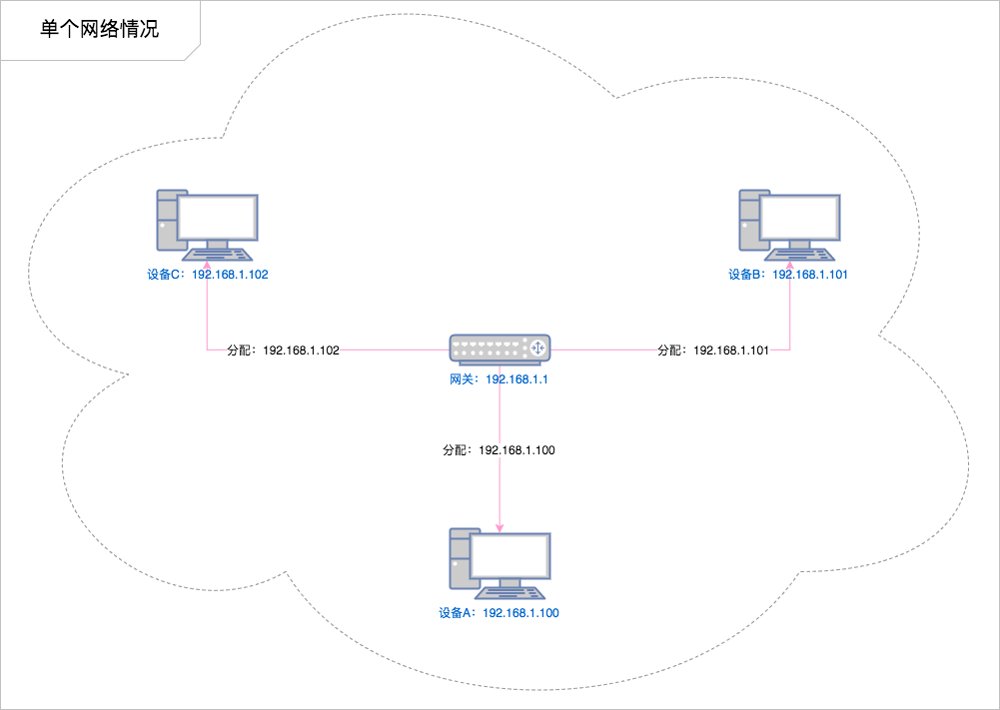

#### 多个网络情况

但是当一个设备同时处于多个网络下（比如同时连接了有线网卡和无线网卡），就会变得稍微复杂一点：

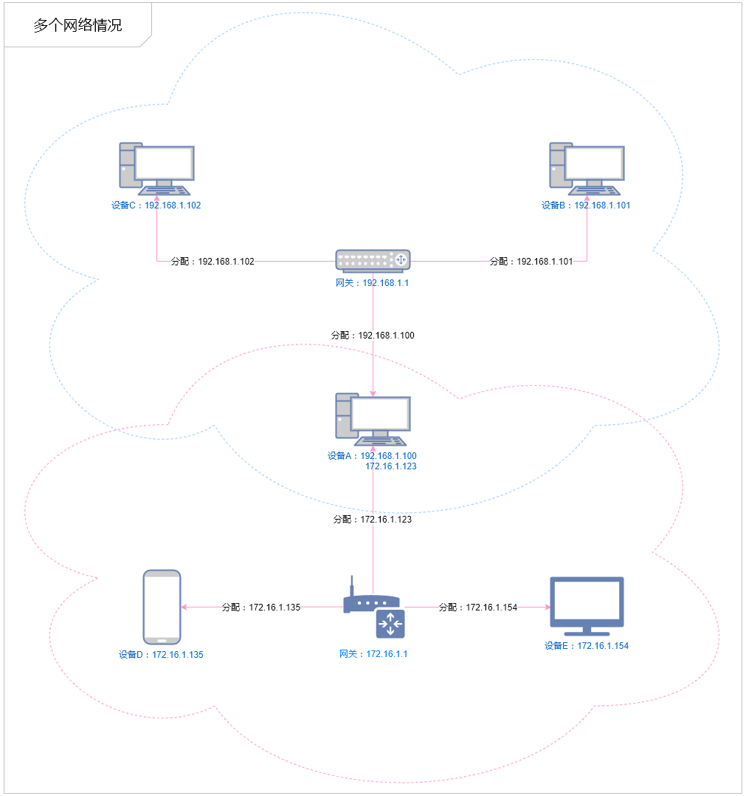

> 例如：
>
> 小明这个同学同时报名了两个课程，在 A 班级小明是班长，所有 A 班级的同学都管他叫班长（叫班长就能找到他）。而在 B 班级小明是课代表，所有 B 班的同学都管他叫课代表（叫课代表就能找到他）。
>
> 同样的一个人在不同的环境有不同的身份，这些身份只有特定的环境才生效。

> 纸上得来终觉浅，绝知此事要躬行！多尝试，多思考才能更好的理解这个问题。

### 域名

由于 IP 地址都是没有规律的一些数字组成的，很难被人记住，不利于广泛传播，所以就有人想出来要给 IP 起名字（别名）。

> 域名是需要花钱注册的

### DNS

通过宽带运营商提供的服务器解析一个域名背后对应的 IP，这个过程叫做 **DNS 寻址**，帮你完成 DNS 寻址过程的服务器叫做 **DNS 服务器**。

#### hosts 文件

操作系统在发起对 DNS 服务器的查询请求之前，会优先检查本机的 hosts 文件。如果这个文件中包含了对当前需要解析的域名的配置，则不再发起对 DNS 服务器的请求，直接使用 hosts 文件中的配置。

**文件所在路径：**

- Windows：`C:\Windows\System32\drivers\etc\hosts`
- macOS：`/etc/hosts`

> **注意：**
>
> - 本机的 hosts 文件配置只能到影响本机的 DNS 寻址
> - 只有以管理员权限运行的编辑器才有权利修改 `hosts` 文件

### 端口

计算机本身是一个封闭的环境，就像是一个大楼，如果需要有数据通信往来，必须有门，这个门在术语中就叫端口，每一个端口都有一个编号，每台计算机只有 65536 个端口（0-65535）。

> 一般我们把“占门”的过程叫做监听

可以通过在命令行中运行： `netstat -an` 命令监视本机端口使用情况：

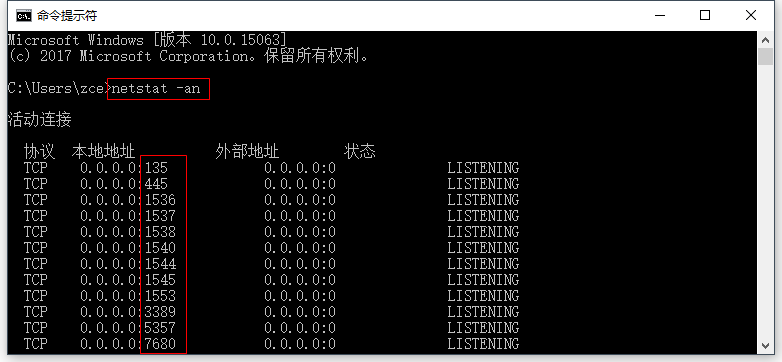

> 参考链接：
>
> - https://baike.baidu.com/item/%E6%9C%8D%E5%8A%A1%E5%99%A8%E7%AB%AF%E5%8F%A3
> - https://baike.baidu.com/item/%E7%AB%AF%E5%8F%A3
> - `http` 默认的端口 `80`
> - `https` 默认的端口是 `443`

### URL

URL（Uniform Resource Locator），统一资源定位符，通俗点来说就是表示网络当中某一个网页的完整访问地址，它具有一定的格式：

```
┌─────────────────────────────────────────────────────────────────────────────────────────────┐
│                                            href                                             │
├──────────┬──┬─────────────────────┬─────────────────────┬───────────────────────────┬───────┤
│ protocol │  │        auth         │        host         │           path            │ hash  │
│          │  │                     ├──────────────┬──────┼──────────┬────────────────┤       │
│          │  │                     │   hostname   │ port │ pathname │     search     │       │
│          │  │                     │              │      │          ├─┬──────────────┤       │
│          │  │                     │              │      │          │ │    query     │       │
"  https:   //    user   :   pass   @ sub.host.com : 8080   /p/a/t/h  ?  query=string   #hash "
│          │  │          │          │   hostname   │ port │          │                │       │
│          │  │          │          ├──────────────┴──────┤          │                │       │
│ protocol │  │ username │ password │        host         │          │                │       │
├──────────┴──┼──────────┴──────────┼─────────────────────┤          │                │       │
│   origin    │                     │       origin        │ pathname │     search     │ hash  │
├─────────────┴─────────────────────┴─────────────────────┴──────────┴────────────────┴───────┤
│                                            href                                             │
└─────────────────────────────────────────────────────────────────────────────────────────────┘
```

例如：https://zce.me:80/schools/students?id=18&name=zce#photo

## 请求响应流程

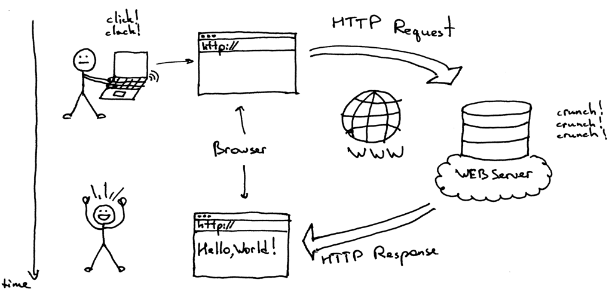

1. 用户打开浏览器
2. 地址栏输入我们需要访问的网站网址（URL）
3. 浏览器通过 DNS 服务器获取即将访问的网站 IP 地址
4. 浏览器发起一个对这个 IP 的请求
5. 服务端接收到这个请求，进行相应的处理
6. 服务端将处理完的结果返回给客户端浏览器
7. 浏览器将服务端返回的结果呈现到界面上

## 配置 Apache

> 配置文档：http://httpd.apache.org/docs/current/
>
> 配置文件中行首的 `#` 指的是注释
>
> **注意**：以下所记录的行号仅供参考，不同版本的配置文件可能不尽相同。

### 监听端口

监听端口可以随意修改为任意一个未被其他程序监听的端口，可以通过设置配置文件 `httpd.conf` 中的 `Listen` 指令后面的数字修改。

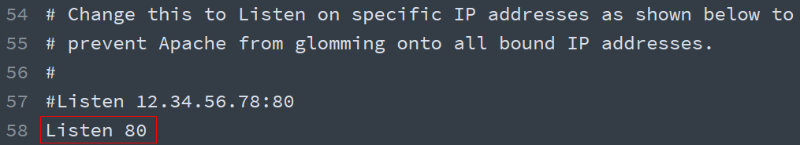

### 网站根目录

> **网站根目录**就是存放我们网站文件的最顶层目录，通常 URL 中域名后面的第一个斜线对应（映射）的就是网站根目录。
>
> **默认文档**指的是我们在访问某一个目录时（没有指定具体的文件），默认访问的文件叫做默认文档
>
> **注**：动态网站情况会比较特殊，需要单独考虑，不一定是这个规则。
>

默认 Apache 的网站根目录是安装目录中的 `htdocs` 文件夹，为了方便对网站文件的管理，一般我们会将其设置在一个自定义目录中（如果你不介意其实不修改也无所谓）。

如果需要设置网站根目录，可以通过修改配置文件 `httpd.conf` 中的网站根目录选项切换。

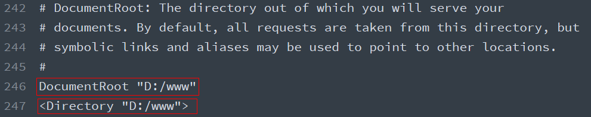

### 默认文档

> 当客户端访问的是一个目录而不是具体文件时，服务端默认返回这个目录下的某个文档（文件），这个文档就称之为**默认文档**。

配置文件 `httpd.conf` 的 280 行的 `DirectoryIndex`，默认文档可以配置多个（有前到后依次去找，找到为止，如果没找到任何一个则启用目录浏览）：

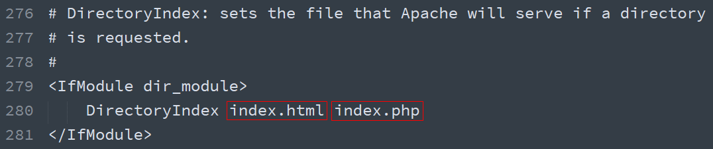

### 虚拟主机

如果一台机器上只有一个网站的话，没有任何问题，但是如果想要在一台机器上部署多个站点，就必须通过配置虚拟主机的方式解决。

> 由于后期对虚拟主机的配置操作非常常见，所以我们一般将虚拟主机的配置单独放到一个配置文件中，然后在主配置文件中引入，避免破坏主配置文件中的其他配置。
>
> `Include conf/extra/httpd-vhosts.conf` 配置的作用就将另外一个配置文件引入（使其生效）

具体的操作方式就是在主配置文件 `httpd.conf` 的 505 行取消注释：


然后找到 Apache 的虚拟主机配置文件，添加一个如下的虚拟主机配置节点，然后重新启动 Apache。

> 这个文件中有两个默认的示例配置，可以注释掉

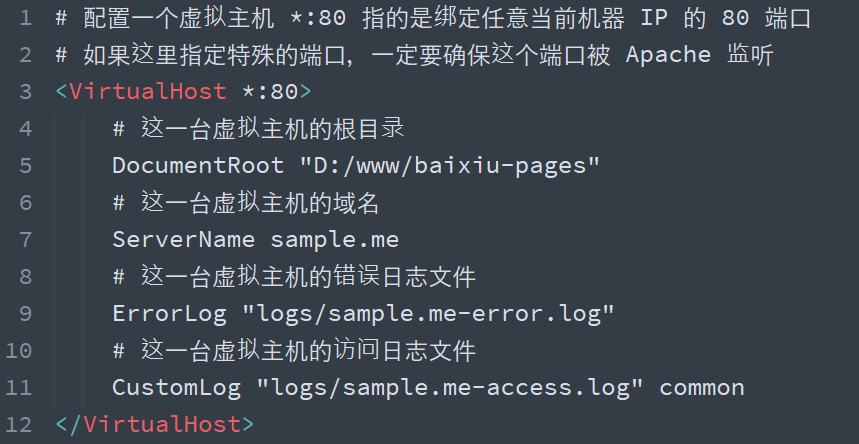

如果真的要使用 `baixiu.com` 这个域名的话，就只能通过修改 `hosts` 文件达到目的，原因很简单：这个域名不是我们自己的，我们没有办法修改这个域名在公网上的 DNS。

> 注意：
>
> - 如果使用了虚拟主机，则默认必须全部使用虚拟主机，即之前的默认网站也必须通过虚拟主机方式配置，否则访问不到。参考：http://skypegnu1.blog.51cto.com/8991766/1532454
>
> - 如果虚拟主机的端口使用的不是 `80`，则需要在主配置文件中添加一个对这个端口的监听：
>
>   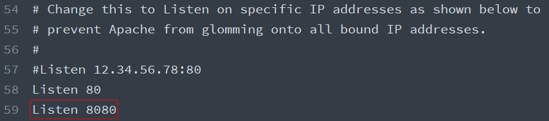
>
>   Forbidden情况通过添加一个Directory 节点解决

## 静态网站与动态网站

至此，我们已经可以把这些静态页面放到服务器上了，客户端也可以通过域名请求这个网站，但是对于我们来说，Apache 能够完成的事情过于简单，无外乎就是找到你请求对应的文件 → 读取文件 → 将文件内容响应给客户端浏览器（**文件原封不动的给你**）。**无法满足让网页内容动起来（随着数据动态变化）的需求。**

于是乎，就有人提出了**服务端动态网页的概念**，这种实现这种概念的技术有很多种：JSP、ASP.NET、PHP、Node 等等。

这些技术的原理就是：不再将 HTML 固定写死，每次用户请求时，动态执行一段代码，临时生成一个用户想要的 HTML 页面。

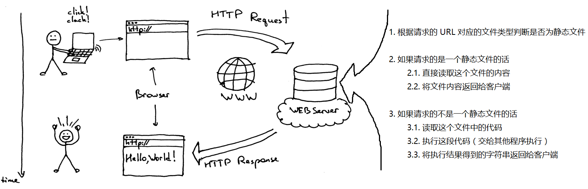

**动态网站指的也就是每次请求时服务端动态生成 HTML 返回给用户的这种网站。**

这里我们选择 PHP 作为我们了解服务端动态网页开发的技术方案，注意：**我们学习的重心不在 PHP，而是了解服务端开发，以及某些其他对前端开发有帮助的东西。**

### 配置 PHP 支持

> PHP 文件的扩展名就是 `.php`

我们可以尝试在刚刚配置的网站中添加一个扩展名为 `php` 的文件，然后到浏览器中访问它。

```php
<!-- demo.php -->
<?php echo 'Hello PHP'; ?>
```

结果出乎意料，并没有显示我们想要的 `Hello PHP`，而是将我们的代码原封不动的返回给浏览器了。

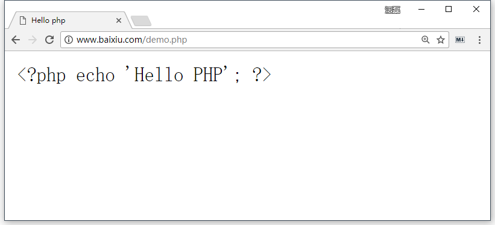

原因很简单：Apache 只能处理静态文件请求，对于后缀名为 `.php` 这种动态文件，它无法执行，所以就当成是一个静态文件直接返回了。

**解决方法**：

- 在服务器上安装 PHP

  - 解压 php 到纯英文路径目录中

- 在 Apache 中添加支持 PHP 的配置

  - 在 Apache 添加 PHP 处理模块

    ```ini
    # php support
    LoadModule php7_module C:/Develop/php/php7apache2_4.dll
    ```

  - 在 `<IfModule mime_module>` 节点中添加 `.php` 扩展名解析支持

    ```ini
    # parse .php files
    AddType application/x-httpd-php .php
    ```

  - 默认文档配置节点 `<IfModule dir_module>` 中添加 `index.php`

    > 默认文档指的是在访问一个目录而不是具体文件名时，默认执行的文件名

    ```ini
    <IfModule dir_module>
        DirectoryIndex index.html index.php
    </IfModule>
    ```

- 重启 Apache

### Apache 与 PHP

对于很多初学者来说，很容易把 Apache 和 PHP 混在一起 混为一谈，其实他们两者各自有各自负责的领域，各自的职责，但是我们在使用 PHP 做动态网站开发时，两者就会产生联系，具体如下：

> Apache 是根据文件的扩展名找到文件的类型，然后挨个问一下每一个模块能否处理这个类型的文件，如果这些模块都不能处理，那么 Apache 就自己处理（按照静态文件的方式处理）

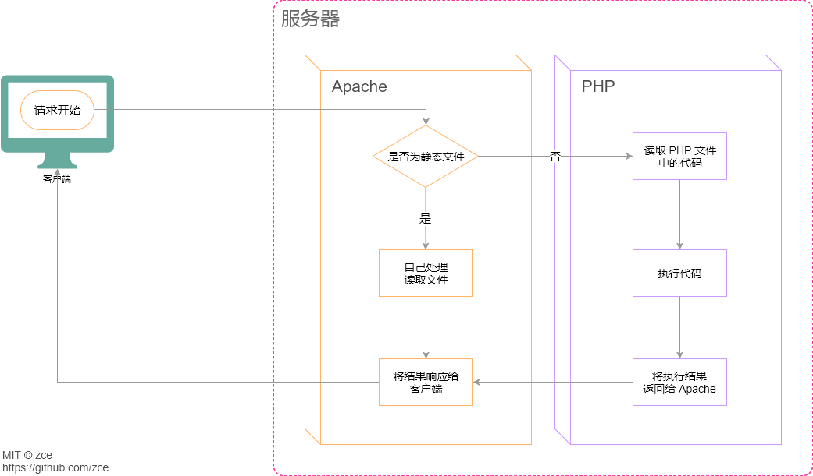

> 你可以理解为：Apache 是一家没有太多能力的公司，只能处理一些简单的业务（静态网站），但是心很大想做更多的事（动态网站），所以就想到了外包，所有额外的业务都需要外包给其他程序，而 PHP 就是理解为一个专门能够处理 php 业务的外包公司

## 作业

- 安装 Apache 并配置，确保本机可以访问。
- 同桌相互访问对方提供的 Web 服务。
- 让 Apache 支持 php 文件的运行。
- 可以配置网站的默认文档。


