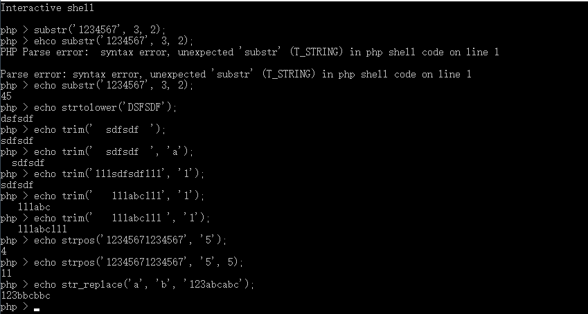

# PHP

> 详细文档：http://php.net/manual/zh/index.php

## 起步

> - PHP 是什么？
> - PHP 写在哪？
> - PHP 能做啥？

> 超文本标记是用普通文本描述富文本的一种方式

PHP（PHP: Hypertext Preprocessor）是一种被广泛应用的脚本语言，它可以被嵌入到 HTML中，尤其适合做动态网站开发开发。

我们接下来会在 PHP 中看到的许多代码特性和其他编程语言类似，例如：变量、函数、循环，等等。 代码语法看起来不同，但是在概念上是基本类似的。

我们使用 PHP 的目的就是能让静态网页变成动态网页，能称之为动态网页的核心就是让 HTML 上的内容不再被写死，而是通过在 HTML 中嵌入一段可以在服务端执行的代码，从而达到动态网页的目标。

例如：我们需要有一个网页，这个网页每次打开都可显示当前的年月日，如果采用 HTML 处理：

```html
<!DOCTYPE html>
<html lang="en">
<head>
  <meta charset="UTF-8">
  <title>当前日期</title>
</head>
<body>
  <h1>2020-01-01</h1>
</body>
</html>
```

我们必须每天到服务器上修改这个网页，从而让它保持显示最新日期，但是有了 PHP 这种能够在服务端执行的脚本语言就可以很轻松实现：

```php
<!DOCTYPE html>
<html lang="en">
<head>
  <meta charset="UTF-8">
  <title>当前日期</title>
</head>
<body>
  <h1><?php echo date('Y-m-d'); ?></h1>
</body>
</html>
```

从以上这个最最简单的基础案例就能看出：PHP 无外乎为了可以在网页中动态输出最新内容的一种技术手段。

> 历史使人明智：http://php.net/manual/zh/history.php.php

### PHP 标记

> http://php.net/manual/zh/language.basic-syntax.phpmode.php

- `<?php` 可以让代码进入“PHP 模式”
- `?>` 可以让代码退出“PHP 模式”

```php
<!DOCTYPE html>
<html lang="en">
<head>
  <meta charset="UTF-8">
  <title>这是一个包含 PHP 脚本的网页</title>
</head>
<body>
  <h1>这是一个包含 PHP 脚本的网页</h1>
  <p>这里原封不动的输出</p>

  <?php
  // 这里是 PHP 代码，必须满足 PHP 语法
  $foo = 'bar';
  echo $foo;
  ?>

  <p>这里也不变</p>

  <p><?php echo '<b>这还是 PHP 输出的</b>'; ?></p>
</body>
</html>
```

类似于在 HTML 中使用 JavaScript，但是不同的是 JavaScript 运行在客户端，而 PHP 运行在服务端。

**只有处于 PHP 标记内部的代码才是 PHP 代码，PHP 标记以外都原封不动。**

#### 省略结束标记

如果 PHP 代码段处于整个文件的末尾，建议（必须）删除结束标记，这样不会有额外的空行产生。

### 输出内容方式

- echo

  ```php
  <?php
  // echo 是 PHP 中的一个特殊的“指令”，
  // 不一定需要像函数那样通过 `()` 去使用
  // 注意：echo 后面紧跟着一个空格
  echo 'hello php';
  echo 'hello', 'world';
  // => `helloworld`
  ```

- print：

  ```php
  <?php
  // print 与 echo 唯一区别就是只能有一个参数
  print 'hello php';
  // print 'hello', 'world';
  // => Parse error: syntax error ...
  ```

> 还有一些输出函数（可以通过查手册自学，用到再说），例如：var_dump(); print_r();

### 与 HTML 混编

- 普通嵌入

  ```php
  <p><?php echo 'hello'; ?></p>
  ```

- 语句混编

  ```php
  <?php if ($age >= 18) { ?>
    <p>成年人</p>
  <?php } else { ?>
    <p>小朋友</p>
  <?php } ?>
  ```

  更常见的用法：

  ```php
  <?php if ($age > 18): ?>
    <p>成年人</p>
  <?php else: ?>
    <p>小朋友</p>
  <?php endif ?>
  ```

### 注释

你可以在代码中添加注释，从而增强我们代码的可阅读性。PHP 中注释有两种方式（与 JavaScript 相同）：

- 单行注释

  ```php
  <?php
  // 这是一条单行注释
  # 井号也可以做注释（不要用）
  $foo = 'hello';
  ?>
  ```

- 多行注释

  ```php
  <?php
  /*
  ......
  这里可以添加任意行数的注释内容
  ......
  */
  $foo = 'hello';
  ?>
  ```

## 语法

编程语言常见的语法

- 用于临时存放数据的容器 --- 变量
- 如果怎样就怎样否则怎样 --- 分支
- 不断的做某件相同的事   --- 循环
- 先干什么再干什么      --- 顺序结构
- 提前设计好一件事怎么干 --- 函数
- 运算符 - 
- 字面量 - 在代码中用某些字符组成 能够表达一个具体的值 这种字符就称之为字面量

PHP 也是另外种编程语言，作为另外一种编程语言，PHP 也具备着绝大多数语言都有的特点，例如变量、条件分支、循环、函数等等，不同的是每个语言都会有自己的语法规定。这里不用太过担心，这些语法规定与之前学习的编程语言大同小异，对我们来说不会有太大的压力。

### 变量

> 变量是编程语言中临时存放数据的容器。

PHP 中申明一个变量是用一个美元符号后面跟变量名来表示。变量名同样是区分大小写的。

PHP 中变量无需声明类型，变量的类型根据值的类型来推断。

```php
<?php
$foo; // 申明一个变量，变量名为 `foo`，未对其进行赋值
$bar = 'baz'; // 申明一个变量，将一个值为 `baz` 的字符串赋值给它
echo $foo; // 输出一个变量名为 `foo` 的变量
fn($bar); // 将一个变量名为 `foo` 的变量作为 `fn` 的实参传递
```

#### 数据类型

常见的 PHP 数据类型与 JavaScript 基本一致：

- string
- integer --- 整型
- float     --- 浮点型
- boolean
- array
- object
- NULL

##### 字符串

PHP 有多种创建字符串的方式：单引号、双引号等。

- 单引号字符串
  - 不支持特殊的转义符号，例如 `\n`
  - 如果要表示一个单引号字符内容，可以通过 `\'` 表达
  - 如果要表示一个反斜线字符内容，可以通过 `\\` 表达
- 双引号字符串
  - 支持转义符号
  - 支持变量解析

```php
<?php
// ====== 单引号 ======
echo 'hello\nworld';
// => `hello\nworld`
echo 'I\'m a better man';
// => `I'm a better man`
echo 'OS path: C:\\Windows';
// => `OS path: C:\Windows`

// ====== 双引号 ======
echo "hello\nworld";
// => `hello
// world`
$name = 'zce';
echo "hello $name";
// => `hello zce`
```

> 字符串函数
>
> - http://php.net/manual/zh/ref.strings.php
> - http://www.w3school.com.cn/php/php_string.asp

##### 数组

PHP 中数组可以分为两类：

- 索引数组

  与 JavaScript 中的数组基本一致

  ```php
  <?php
  // 定义一个索引数组
  $arr = array(1, 2, 3, 4, 5);
  print_r($arr);

  // PHP 5.4 以后定义的方式可以用 `[]`
  $arr2 = [1, 2, 3, 4, 5];
  print_r($arr2);
  ```

- 关联数组

  有点类似于 JavaScript 中的对象

  ```php
  <?php
  // 注意：键只能是`integer`或者`string`
  $arr = array('key1' => 'value1', 'key2' => 'value2');
  print_r($arr);

  // PHP 5.4 以后定义的方式可以用 `[]`
  $arr2 = ['key1' => 'value1', 'key2' => 'value2'];
  print_r($arr2);
  ```

#### 数据类型转换

> http://php.net/manual/zh/language.types.type-juggling.php

### 运算符

数学运算符，逻辑运算符与 JavaScript 基本一致，无特殊情况。

字符串连接（拼接）采用的是比较特殊的 `.`

```php
<?php
$name = 'zce';
// 拼接 `hey ` 和 `zce`
$message = 'hey ' . $name;
// 相当于 +=
$foo .= $message
```

### 语句

- 分号分割
- if、switch、while、for、 foreach、function......

### 流程控制

- 顺序结构

- 分支结构

  - if ... else
  - switch ... case

- 循环结构

  - for

  - while

  - foreach --- 专门用来遍历数组

    ```php
    <?php
    $arr = array('name' => 'zhangsan', 'age' => '18');

    foreach ($arr as $key => $value) {
      echo $key . ' ' . $value;
    }
    ```

指令式的 if、for、foreach、while 单独掌握

### 函数

定义与使用函数的方式与 JavaScript 相同：

```php
<?php
// 函数名不区分大小写
function foo ($name, $title) {
  echo "$name ($title)";
}

// 调用
foo('zce', 'UFO');
Foo('zgd', 'SBO'); // 大小写不区分
```

注意：使用方式有点差异（函数名不区分大小写），但是不要这么搞！！！

> 建议在 PHP 中采用下划线式（snake_case）做命名规则，不管是函数还是变量

## 特性

### 变量作用域

关于变量作用域这一点，PHP 与绝大多数语言也都不同：**默认函数内不能访问函数所在作用域的成员。**

在 JavaScript 中，我们可以在函数作用域中使用父级作用域中的成员：

```javascript
var top = 'top variable'

function foo () {
  var sub = 'sub variable'
  
  console.log(top)
  // => `top variable`

  function bar () {
    console.log(top)
    // => `top variable`
    console.log(sub)
    // => `sub variable`
  }
  
  bar()
}

foo()
```

而在 PHP 中：

```php
<?php
$top = 'top variable';

function foo () {
  $sub = 'sub variable';
  
  echo $top;
  // => 无法拿到

  function bar () {
    echo $top;
    // => 无法拿到
    
    echo $sub;
    // => 无法拿到
  }

  bar();
}

foo();
```

如果需要访问全局变量，可以通过 `global` 关键字声明：

```php
<?php
$top = 'top variable';

function foo () {
  // 声明在当前作用域中获取全局作用域中的 `$top`
  global $top;
  
  $sub = 'sub variable';
  
  echo $top;
  // => `top variable`

  function bar () {
    // 声明在当前作用域中获取全局作用域中的 `$top` 和 `$bar`
    global $top, $bar;
    
    echo $top;
    // => `top variable`
    
    echo $sub;
    // => 任然无法拿到，因为 `$sub` 不再全局范围，而是在 `foo` 函数中定义
  }

  bar();
}

foo();
```

### 超全局变量

> http://www.w3school.com.cn/php/php_superglobals.asp

PHP 中的许多预定义变量都是“超全局的”，这意味着它们在一个脚本的全部作用域中都可用。在函数或方法中无需执行 global $variable; 就可以访问它们。

这些超全局变量是：

- $GLOBALS — 引用全局作用域中可用的全部变量
- $_SERVER — 获取服务端相关信息
- $_REQUEST — 获取提交参数
- $_POST — 获取 POST 提交参数
- $_GET — 获取 GET 提交参数
- $_FILES — 获取上传文件
- $_ENV — 操作环境变量
- $_COOKIE — 操作 Cookie
- $_SESSION — 操作 Session

本节会介绍一些超全局变量，并会在稍后的章节讲解其他的超全局变量。

#### $GLOBALS

$GLOBALS 这种全局变量用于在 PHP 脚本中的任意位置访问全局变量（从函数或方法中均可）。

PHP 在名为 $GLOBALS[index] 的数组中存储了所有全局变量。变量的名字就是数组的键。

下面的例子展示了如何使用超级全局变量 $GLOBALS：

```php
<?php
$x = 75;
$y = 25;

function foo () {
  $GLOBALS['z'] = $GLOBALS['x'] + $GLOBALS['y'];
}
 
foo();
echo $z;
// => 100
```

### 常量定义与使用

> 常量跟变量一样也是一个数据容器，但是不同的是一旦申明过后就不允许被修改。

#### 定义常量

```php
<?php
// 定义常量使用的是内置的 `define` 函数
// 第一个参数是常量的名称，建议采用全大写字母命名，多个单词下划线分隔
// 第二个参数是常量中存放的数据，可以是任意类型
// 第三个参数是常量名称是否区不分大小写，默认 false 区分大小写
define('SYSTEM_NAME', '阿里百秀');
define('SYSTEM_ENABLE', true);
```

#### 使用常量

```php
<?php
// 直接通过常量的名称访问常量
// 与变量不同的是不需要用 $
echo SYSTEM_NAME;
echo SYSTEM_ENABLE;
```

### 载入其他文件

通常情况下，当一个文件中的代码过长，自然会想到要拆分到多个文件中。随着开发经验的积累，慢慢的会发现，除了文件过程应该拆分文件，更应该做的事情是根据用途去划分。

不管你是怎样想的，核心问题都是一样：怎么将代码拆分到多个文件中？

PHP 中引入其他 PHP 文件有四种方式：

- require
- require_once
- include
- include_once

四种方式的对比：

|                    | require | require_once | include | include_once |
| ------------------ | ------- | ------------ | ------- | ------------ |
| 被载入文件如果不存在是否影响继续运行 | Y       | Y            | N       | N            |
| 多次调用是否会重复执行被载入的文件  | Y       | N            | Y       | N            |

总结来说：

- 横向分为两类：require 和 include 两种，区别在于 require 会因为载入文件不存在而停止当前文件执行，而 include 不会。
- 纵向分为两类：xxx 和 xxx_once，区别在于代码中每使用一次 xxx 就执行一次载入的文件，而 xxx_once 只会在第一次使用是执行。

使用层面：

- include 一般用于载入公共文件，这个文件的存在与否不能影响程序后面的运行
- require 用于载入不可缺失的文件
- 至于是否采用一次载入（once）这种方式取决于被载入的文件

## 常用 API

> 任何编程语言本身并没有太多的能力，具体的能力大多数都来源于 API。

PHP 的能力来源于它有 1000+ 内置函数，不是每一个函数都默认直接可以使用，有一些需要安装或者启用额外的"插件" 扩展

### 字符串处理

> 宽字符集需要开启 php_mbstring 扩展

#### 开启 PHP 扩展

1. 将PHP目录中的 php.ini-development 复制一个 修改为 php.ini
2. 修改扩展文件所在目录 extension_dir
3. 修改文件中的部分选项（; 是注释符）
4. 在 Apache 配置文件中申明一下 php.ini 的所在目录

#### 字符串处理函数

- 字符串截取
  - `string substr ( string $string , int $start [, int $length ] )`
  - `string mb_substr ( string $str , int $start [, int $length = NULL [, string $encoding = mb_internal_encoding() ]] )`
- 字符串长度
  - `int strlen ( string $string )`
  - `mixed mb_strlen ( string $str [, string $encoding = mb_internal_encoding() ] )`
- 大小写转换
  - `string strtolower ( string $string )`
  - `string strtoupper ( string $string )`
- 去除首尾空白字符
  - `string trim ( string $str [, string $character_mask = " \t\n\r\0\x0B" ] )`
  - `string ltrim ( string $str [, string $character_mask ] )`
  - `string rtrim ( string $str [, string $character_mask ] )`
- 查找字符串中某些字符首次出现位置
  - `mixed strpos ( string $haystack , mixed $needle [, int $offset = 0 ] )`
  - `int mb_strpos ( string $haystack , string $needle [, int $offset = 0 [, string $encoding = mb_internal_encoding() ]] )`
- 字符串替换
  - `mixed str_replace ( mixed $search , mixed $replace , mixed $subject [, int &$count ] )`
- 重复字符串
  - `string str_repeat ( string $input , int $multiplier )`



### 数组处理

- 获取关联数组中全部的键 / 值
  - `array_keys() / array_values()`
- 判断关联数组中是否存在某个键
  - `array_key_exists()`
- 去除重复的元素
  - `array_unique()`
- 将一个或多个元素追加到数组中
  - `array_push()`
  - `$arr[] = 'new value'`
- 删除数组中最后一个元素
  - `array_pop()`
- 数组长度
  - `count()`
- 检测存在
  - `in_array()`


### 时间处理

- 时间戳：`time()`
  - 从 Unix 纪元（格林威治时间 1970-01-01 00:00:00）到当前时间的秒数
- 格式化日期：`date()`
  - 获取有格式的当前时间
  - 格式化一个指定的时间戳
  - 可以通过 `strtotime()` 将有格式的时间字符串转换为时间戳

### 文件操作

pathinfo() 文件信息

[basename()](http://www.w3school.com.cn/php/func_filesystem_basename.asp)查找最后一级目

[dirname()](http://www.w3school.com.cn/php/func_filesystem_dirname.asp)查找父级目录

[filesize()](http://www.w3school.com.cn/php/func_filesystem_filesize.asp)读取文件大小

[file_exists()](http://www.w3school.com.cn/php/func_filesystem_file_exists.asp)检查文件是否存在

[is_dir()](http://www.w3school.com.cn/php/func_filesystem_is_dir.asp)是否为目录

[is_file()](http://www.w3school.com.cn/php/func_filesystem_is_file.asp)是否为文件

realpath() 绝对路径

rename() 修改文件名

[file_get_contents()](http://www.w3school.com.cn/php/func_filesystem_file_get_contents.asp)读取文件

[file_put_contents()](http://www.w3school.com.cn/php/func_filesystem_file_put_contents.asp)写入文件

[move_uploaded_file()](http://www.w3school.com.cn/php/func_filesystem_move_uploaded_file.asp)文件上传

copy() 复制文件

unlink() 删除文件

mkdir() 创建目录

rmdir() 删除空目录

opendir 打开目录

readdir 读取目录

closedir 关闭目录

scandir 查找指定目录文件及子目录
