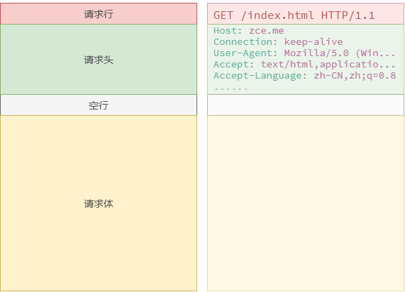
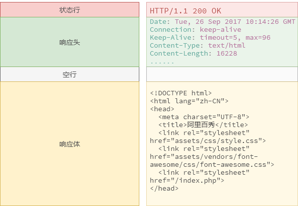

# HTTP

## 概要

### 定义

HTTP（HyperText Transfer Protocol，超文本传输协议）最早就是计算机与计算机之间沟通的一种标准协议，这种协议限制了通讯**内容的格式**以及各项**内容的含义**。


随着时代的发展，技术的变迁，这种协议现在广泛的应用在各种领域，也不仅仅局限于计算机与计算机之间，手机、电视等各种智能设备很多时候都在使用这种协议通讯，所以一般现在称 **HTTP 为端与端之间的通讯协议**。

Web 属于 B/S 架构的应用软件，在 B/S 架构中，浏览器与服务器沟通的协议就是 HTTP 协议，作为一个合格的 Web 开发者，了解 HTTP 协议中约定的内容是一门必修课。

> 应用软件架构一般分为两类：
>
> - B/S 架构：Browser（浏览器） ←→ Server（服务器），这种软件都是通过浏览器访问一个网站使用，服务器提供数据存储等服务。
> - C/S 架构：Client（客户端） ←→ Server（服务器），这种软件通过安装一个软件到电脑，然后使用，服务器提供数据存储等服务。

### 约定内容

- 请求 / 响应报文格式
- 请求方法 —— GET / POST / etc.
- 响应状态 —— 200 / 404 / 302 / 304 / etc.
- 预设的请求 / 响应头

### 约定形式

1. 客户端通过随机端口与服务端某个固定端口（一般为80）**建立连接** 三次握手
2. 客户端通过这个连接**发送请求**到服务端（这里的请求是名词）
3. 服务端监听端口得到的客户端发送过来的请求
4. 服务端通过连接响应给客户端状态和内容（响应报文）

> 要求：接下来的一个月，每次上网打开任何一个页面时都要能够脑补这个画面，默念这个流程。

## 核心概念

### 报文

#### 请求报文




##### 请求行

`GET /demo.php HTTP/1.1`

请求方式 + 空格 + 请求路径 + 空格 + HTTP 协议版本

##### 请求头

客户端想要告诉服务端的一些额外信息，以下为常见的请求头：

| 键               | 值                           |
| --------------- | --------------------------- |
| Host            | 请求的主机                       |
| Cache-Control   | 控制缓存（例如：max-age=60 缓存 60 秒） |
| Accept          | 客户端想要接收的文档类型，逗号分隔           |
| User-Agent      | 标识什么客户端帮你发送的这次请求            |
| Referer         | 这次请求的来源                     |
| Accept-Encoding | 可以接受的压缩编码                   |
| Cookie          | 客户端本地的小票信息                  |

##### 请求体

这次请求客户端想要发送给服务端的数据正文，一般在 GET 请求时很少用到，因为 GET 请求主观上都是去“拿东西”。

#### 响应报文



##### 状态行

`HTTP/1.1 200 OK`

HTTP 协议版本 + 空格 + 状态码 + 空格 + 状态描述

##### 响应头

服务端想要告诉客户端的一些额外信息，常见的有以下：

| 键              | 值          |
| -------------- | ---------- |
| Date           | 响应时间       |
| Server         | 服务器信息      |
| Content-Type   | 响应体的内容类型   |
| Content-Length | 响应的内容大小    |
| Set-Cookie     | 让客户端设置一个小票 |

如果需要在程序中设置自定义的响应头（不是预设的），建议使用 `X-<Property-Name>` 规则

##### 响应体

这次请求服务端想要返回给客户端的数据正文，一般返回的都是 HTML，也可以返回 JavaScript 或者 CSS（需要修改响应头中的响应类型）。

#### 应用场景

- 设置响应文件类型

  - `header('Content-Type: text/css');`
  - 常见的 HTTP MIME type：`text/css` `text/html` `text/plain` `applcation/javascript`

- 重定向（跳转到其他网页）

  - `header('Location: https://www.baidu.com');`

- 下载文件

  ```php
  // 让文件下载
  header('Content-Type: application/octet-stream');
  // 设置默认下载文件名
  header('Content-Disposition: attachment; filename=demo.txt');
  ```

- 图片防盗链

  - 通过判断请求来源 `Referer` 是否为本网站从而区分是否是合法请求

### 请求方式

> http://www.w3school.com.cn/tags/html_ref_httpmethods.asp
>
> http://www.runoob.com/http/http-methods.html

#### GET

字面意思：拿，获取

#### POST

字面意思：发，给

#### 对比 GET 与 POST

|          | GET                                      | POST                                     |
| -------- | ---------------------------------------- | ---------------------------------------- |
| 后退按钮/刷新  | 无害                                       | 数据会被重新提交（浏览器应该告知用户数据会被重新提交）。             |
| 书签       | 可收藏为书签                                   | 不可收藏为书签                                  |
| 缓存       | 能被缓存                                     | 不能缓存                                     |
| 编码类型     | application/x-www-form-urlencoded        | application/x-www-form-urlencoded 或 multipart/form-data。为二进制数据使用多重编码。 |
| 历史       | 参数保留在浏览器历史中。                             | 参数不会保存在浏览器历史中。                           |
| 对数据长度的限制 | 是的。当发送数据时，GET 方法向 URL 添加数据；URL 的长度是受限制的（URL 的最大长度是 2048 个字符）。 | 无限制。                                     |
| 对数据类型的限制 | 只允许 ASCII 字符。                            | 没有限制。也允许二进制数据。                           |
| 安全性      | 与 POST 相比，GET 的安全性较差，因为所发送的数据是 URL 的一部分。在发送密码或其他敏感信息时绝不要使用 GET ！ | POST 比 GET 更安全，因为参数不会被保存在浏览器历史或 web 服务器日志中。 |
| 可见性      | 数据在 URL 中对所有人都是可见的。                      | 数据不会显示在 URL 中。                           |

### 状态码

> 了解即可，不用刻意去记忆，用多了自然就忘不了。
>
> http://www.w3school.com.cn/tags/html_ref_httpmessages.asp
>
> https://developer.mozilla.org/zh-CN/docs/Web/HTTP/Status

状态代码由三位数字组成，第一个数字定义了响应的类别，且有五种可能取值。

- 1xx：指示信息 —— 表示请求已接收，继续处理。
- 2xx：成功 —— 表示请求已被成功接收、理解、接受。
- 3xx：重定向 —— 要完成请求必须进行更进一步的操作。
- 4xx：客户端错误 —— 请求有语法错误或请求无法实现。
- 5xx：服务器端错误 —— 服务器未能实现合法的请求。

常见状态代码、状态描述的说明如下。

- 200 OK：客户端请求成功。
- 400 Bad Request：客户端请求有语法错误，不能被服务器所理解。
- 401 Unauthorized：请求未经授权，这个状态代码必须和 `WWW-Authenticate` 报头域一起使用。
- 403 Forbidden：服务器收到请求，但是拒绝提供服务。
- 404 Not Found：请求资源不存在，举个例子：输入了错误的URL。
- 500 Internal Server Error：服务器发生不可预期的错误。
- 503 Server Unavailable：服务器当前不能处理客户端的请求，一段时间后可能恢复正常。


https://segmentfault.com/a/1190000006689767