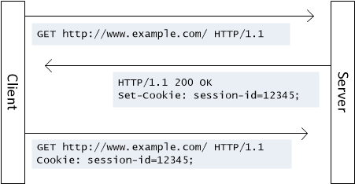

# HTTP 会话

## Cookie

HTTP 很重要的一个特点就是**无状态**（每一次见面都是“初次见面”），如果单纯的希望通过我们的服务端程序去记住每一个访问者是不可能的，所以必须借助一些手段或者说技巧让服务端记住客户端，这种手段就是 **Cookie**。



Cookie 就像是在超级市场买东西拿到的小票，由超市（Server）发给消费者（Browser），超市方面不用记住每一个消费者的脸，但是他们认识消费者手里的小票（Cookie），可以通过小票知道消费者之前的一些消费信息（在服务端产生的数据）。

### PHP 中操作 Cookie

> http://php.net/manual/zh/function.setcookie.php

```php
// 设置 cookie
setcookie('key1', 'value1');  /* 1 小时过期  */
// 获取 cookie
echo $_COOKIE["key1"];
// 删除 cookie
// 原理：设置过期时间为一个过去时间
setcookie('key1');
// 传递第三个参数是设置过期时间
// 不传递就是 会话级别的 Cookie （关闭浏览器就自动删除）
setcookie('key2', 'value2', time() + 1 * 24 * 60 * 60);
// 设置作用路径范围
setcookie('key3', 'value3', time() + 1 * 24 * 60 * 60, '/users');
```

#### path

设置 cookie 的作用路径范围

- `/` => 只要是在网站根目录下的所有连接地址中都可访问这个 Cookie
- `/users` => 只能在 `users` 目录下的路径才能访问

#### domain

设置 cookie 的作用域名范围

- `day-10.io` => 所有的 `day-10.io` 的子域 都可以访问到
  - `bar.day-10.io` √
  - `foo.day-10.io` √
  - `day-11.io` ×
- `bar.day-10.io` => 所有的 `bar.day-10.io` 的子域 都可以访问到
  - `a.bar.day-10.io` √
  - `foo.day-10.io` ×

#### httponly

一旦 cookie 的 httponly 为真，那么只能在服务端获取，JS 无法操作

#### 记住登录名案例

##### 登录功能实现流程

```sequence
客户端->服务端: Request GET /login.php
服务端->客户端: Response 空白表单页面
Note left of 客户端: 用户填写表单
客户端->服务端: Request POST /login.php 表单数据
Note right of 服务端: 服务端对提交过来的数据进行校验
服务端->客户端: Response Location: /main.php\n跳转到 main.php
客户端-->服务端: Request GET /main.php
服务端-->客户端: Response Welcome
Note over 客户端,服务端: ..........
客户端->服务端: Request GET /login.php
服务端->客户端: Response 包含上一次使用的登录名的表单页面
```


### JavaScript 中操作 Cookie

#### Pure JavaScript

> 参考：http://www.runoob.com/js/js-cookies.html

```javascript
// 新增一条 cookie，注意：cookie 是有大小限制，约为 4k
//   格式固定：<key>=<value>[; expires=<GMT格式时间>][; path=<作用路径>][; domain=<作用域名>]
//   除了键值以外其余属性均有默认值，可以省略
//   expires 表示 cookie 失效的时间，默认为关闭浏览器时
//   path 表示 cookie 生效的路径，默认为当路径
//       /   /foo.php   /abc/foo.php
//       /foo     /bar/abc.php
//   domain 表示 cookie 生效的域名，默认为当前域名

document.cookie = 'name=value; expires=Tue, 10 Oct 2017 16:14:47 GMT; path=/; domain=zce.me'
// 获取全部 cookie
console.log(document.cookie)
// => 'key1=value1; key2=value2'
// 得到的结果是字符串，需要自己通过字符串操作解析
```

#### jQuery plugin

https://github.com/carhartl/jquery-cookie

#### without jQuery

https://github.com/js-cookie/js-cookie

## Session

由于 Cookie 是服务端下发给客户端**由客户端本地保存**的。换而言之客户端可以在本地对其随意操作，包括删除和修改。如果客户端随意伪造一个 Cookie 的话，对于服务端是无法辨别的，就会造成服务端被蒙蔽，构成安全隐患。

于是乎就有了另外一种基于 Cookie 基础之上的手段：**Session**


Session 区别于 Cookie 一个很大的地方就是：Session 数据存在了服务端，而 Cookie 存在了客户端本地，存在服务端最大的优势就是，不是用户想怎么改就怎么改了。

Session 这种机制会更加适合于存放一些属于用户而又不能让用户修改的数据，因为客户端不再保存具体的数据，只是保存一把“钥匙”，伪造一把可以用的钥匙，可能性是极低的，所以不需要在意。


> http://php.net/manual/zh/session.examples.basic.php


### 猜数字游戏

> 参考：https://developer.mozilla.org/zh-CN/docs/Learn/JavaScript/First_steps/A_first_splash
>
> 注意：这里是 JavaScript 的实现，经供参考
>
> 建议：好好看看里面写的一些内容

我想让你创建一个可以猜数字的游戏，它会在 1~100 以内随机选择一个数, 然后让玩家挑战在10轮以内猜出这个数字，每一轮都要告诉玩家正确或者错误， 如果出错了，则告诉他数字是低了还是高了，并且还要告诉玩家之前猜的数字是什么。 一旦玩家猜测正确，或者他们用完了回合，游戏将结束。 游戏结束后，可以让玩家选择再次开始。

```html
<!DOCTYPE html>
<html lang="en">
<head>
  <meta charset="UTF-8">
  <title>猜数字</title>
  <style>
    body {
      padding: 100px 0;
      background-color: #2b3b49;
      color: #fff;
      text-align: center;
      font-size: 2.5em;
    }
    input {
      padding: 5px 20px;
      height: 50px;
      background-color: #3b4b59;
      border: 1px solid #c0c0c0;
      box-sizing: border-box;
      color: #fff;
      font-size: 20px;
    }
    button {
      padding: 5px 20px;
      height: 50px;
      font-size: 16px;
    }
  </style>
</head>
<body>
  <h1>猜数字游戏</h1>
  <p>Hi，我已经准备了一个 0 - 100 的数字，你需要在仅有的 10 机会之内猜对它。</p>
  <form action="" method="post">
    <input type="number" min="0" max="100" name="num" placeholder="随便猜">
    <button type="submit">试一试</button>
  </form>
</body>
</html>
```