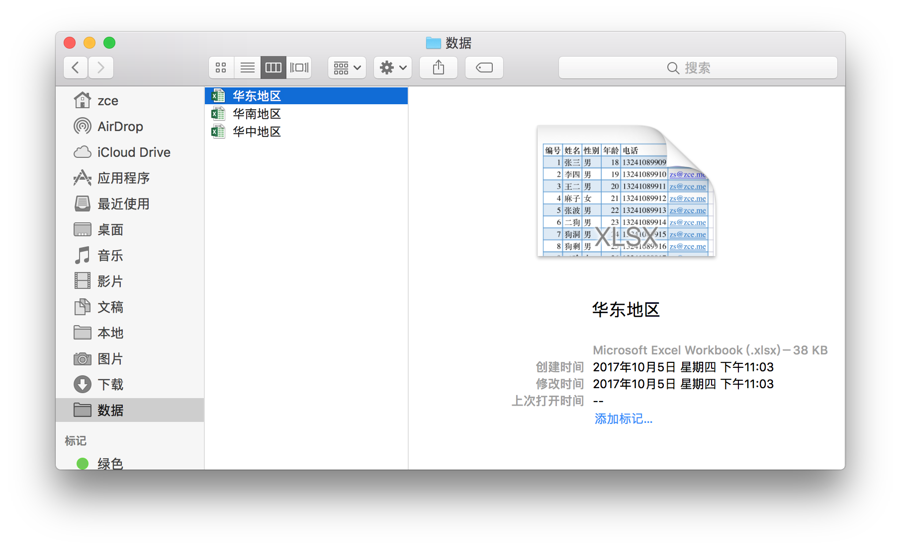
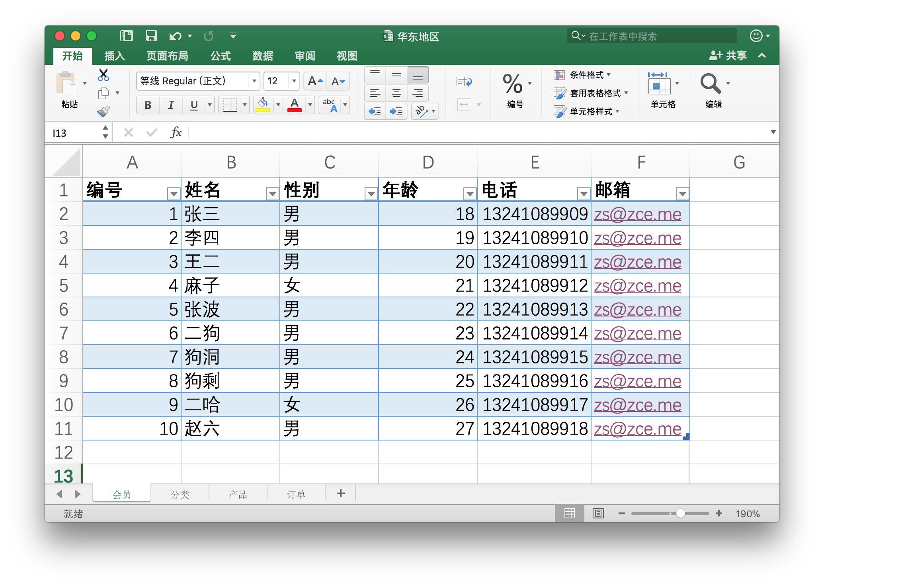

# MySQL

## 准备工作

### 简介

> 目标：
>
> - 搞明白什么是数据库
> - 如何通过工具操作数据库
> - 如何通过代码操作数据库

数据库就是数据的仓库，用来按照特定的结构去组织和管理我们的数据，有了数据库我们就可以更加方便、便捷的操作（C / R / U / D）我们需要保存的数据。

不管是什么数据库，最终都是将数据存到文件（硬盘）中，只是存储的格式不同于文本文件。

一个 Excel 文件就可以看做一个数据库：



一个 Excel 文件中可以包含多个数据表：



### 安装与配置

在开发领域我们存储数据一般都是使用专门的数据库服务器专门提供的数据库服务，如果需要让自己的机器也可以提供数据库服务，那么就需要安装特定的数据库服务器软件，这种类型的软件也有很多：

- Oracle
- MySQL
- SQL Server

这里我们选择一个很常见的数据库服务器软件：MySQL

MySQL 的安装同样建议采用解压版（目的是了解那些自动安装过程都做了哪些事）

> 下载地址：https://dev.mysql.com/downloads/mysql/

#### 安装过程

1. 解压到纯英文路径

2. 解压目录添加 `my.ini` （可选）

   > 参考：
   >
   > - http://www.cnblogs.com/Ray-xujianguo/p/3322455.html
   > - https://gist.github.com/hanjong/1205199
   > - https://dev.mysql.com/doc/refman/5.5/en/mysqld-option-tables.html

   ```
   [mysqld]
   # MySQL 安装目录
   basedir=C:/Develop/mysql
   # 数据文件所在目录
   datadir=C:/Develop/mysql/data
   ```

3. 以管理员身份运行 CMD 执行以下命令，安装一个 MySQL 服务

   ```shell
   # 定位到安装目录下的 bin 文件夹
   $ cd <MySQL安装目录>/bin
   # 初始化数据所需文件以及获取一个临时的访问密码
   $ mysqld --initialize --user=mysql --console
   # 将 MySQL 安装为服务 可以指定服务名称
   $ mysqld --install MySQL
   ```

4. 登入 MySQL 服务器，重置密码

   ```shell
   # 先通过用户名密码进入 MySQL 操作环境
   $ mysql -u root -p
   Enter password: # 输入临时密码

   # 设置数据库访问密码，一定要加分号
   mysql> set password for root@localhost = password('123');
   ```


## 基础操作

### 数据库管理工具

数据库管理工具本质上就是一个使用数据库服务器软件（Server）提供的服务的数据库客户端（Client）。

#### 命令行工具

一般如果只是简单操作数据库，推荐使用 MySQL 内置的命令行工具完成：

通过命令行运行解压目录下 `bin` 目录中的 `mysql.exe`：

```shell
# 定位到 bin 目录
$ cd <解压目录>/bin
# 运行 mysql，-u 指定数据库用户名，-p 指定密码
$ mysql -u root -p wanglei
# 一般不建议在命令中填写密码，因为这样会暴露你的密码，一般只加一个 -p 但是不给值
$ mysql -u root -p
Enter password: # 这时会要求你输入密码
```

进入 MySQL 客户端的 REPL 环境过后，可以通过标准的 SQL 语句操作数据库。

常见的操作指令：

```sql
mysql> show databases;  -- 显示全部数据库
mysql> create database <db-name>;  -- 创建一个指定名称的数据库
mysql> use <db-name>;  -- 使用一个数据库，相当于进入指定的数据库
mysql> show tables;  -- 显示当前数据库中有哪些表
mysql> create table <table-name> (id int, name varchar(20), age int);  -- 创建一个指定名称的数据表，并添加 3 个列
mysql> desc <table-name>;  -- 查看指定表结构
mysql> source ./path/to/sql-file.sql  -- 执行本地 SQL 文件中的 SQL 语句
mysql> drop table <table-name>;  -- 删除一个指定名称的数据表
mysql> drop database <db-name>;  -- 删除一个指定名称的数据库
mysql> exit|quit;  -- 退出数据库终端
```

#### 可视化工具

如果需要复杂的操作，推荐 Navicat Premium

> 下载地址：http://www.navicat.com.cn/download/navicat-premium
>
> 这是一个付费软件，可以免费试用 14 天

### 基本概念

- 数据库
  - 数据库服务软件
  - 数据的仓库
- 表
- 字段 —— 指的就是列
- 字段类型 —— 指的就是列能够存储的数据种类
  - int
  - char(<length>)
  - varchar(<length>)
  - date
  - decimal
- 数据库查询：指的是操作数据库的过程（查、增、删、改）
- 数据库查询语言：SQL

### 基本查询语句

#### 查询

```sql
-- 查询数据
-- select 字段[, 字段2] from 表名
select id, name, birthday from users;
select `id`, `title`, `name` from `users`;

-- 通配 * 找到表中所有列
select * from users;
```

#### 增加

```sql
-- 新增数据
-- 插入全部字段
insert into users values (null, '王五', 0, '2020-12-12', '12312');

-- 指定字段
insert into users (name, gender, avatar) values ('王五', 0, '12312');
```

#### 修改

```sql
-- 更新数据
update users set name = '麻子', gender = 0
```

#### 删除

```sql
-- 删除
-- 删除语句必须指定条件
delete from users 
```

#### 筛选条件

子语句，意思是不能单独执行，必须配合 删除 修改 查询 语句

```sql
delete from users where id = 6
delete from users where id = 6 and gender = 0
delete from users where id = 6 or gender = 0
delete from users where id > 6
delete from users where id in (4, 5)
```

### 常见查询函数

- 总条数 —— count 分页功能，查询总页数
- 最大值、最小值 —— max/min
- 平均值 —— avg

```sql
select fn(field1) from table
```

### 分页查询数据

子语句

`limit <skip>, <length>`

`skip = (page - 1) * length`

## PHP 操作数据库

如何在 PHP 代码中操作数据库是我们能否在自己的程序中使用数据库的核心。

> 数据库扩展：http://php.net/manual/zh/refs.database.php

如果需要使用 MySQLi 扩展，需要在 php.ini 文件中打开这个扩展（解除注释）

```php
// 假定数据库用户名：root，密码：wanglei，数据库：baixiu
$connection = mysqli_connect("localhost", "root", "wanglei", "baixiu");

if (!$connection) {
  // 如果连接失败报错
  die('<h1>Connect Error (' . mysqli_connect_errno() . ') ' . mysqli_connect_error() . '</h1>');
}

$sql = "select * from users";
$result = mysqli_query($connection, $sql);

// 查询数据填充到关联数组
while ($row = mysqli_fetch_assoc($result)) {
  echo $row["id"] . " - " . $row["username"];
}

// 释放结果集
mysqli_free_result($result);

mysqli_close($connection);
```

> - mysqli：
>   - http://php.net/manual/zh/book.mysqli.php
>   - http://www.runoob.com/php/php-ref-mysqli.html
> - *pdo：http://php.net/manual/zh/ref.pdo-mysql.php

### 执行查询语句

### 执行非查询语句

## 案例

基于数据库的增删改查

### 列表功能

- 查询数据

### 增删改

- 增删改数据


## 全部配置总结


```
1. Apache
  1.1. PHPIniDir
  1.2. LoadModule
  1.3. AddType

2. PHP
  2.1. extension_dir
  2.2. php_mbstring.dll
  2.3. php_mysqli.dll
  2.4. data.timezone
  2.5. upload_max_filesize
  2.6. post_max_size
```

