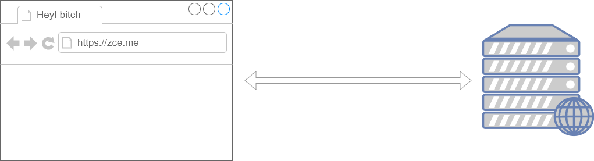

# AJAX

## 概述

> Web 程序最初的目的就是将信息（数据）放到公共的服务器，让所有网络用户都可以通过浏览器访问。



在此之前，我们可以通过以下几种方式让浏览器发出对服务端的请求，获得服务端的数据：

- 地址栏输入地址，回车，刷新
- 特定元素的 href 或 src 属性
- 表单提交

这些方案都是我们无法通过或者很难通过代码的方式进行编程（对服务端发出请求并且接受服务端返回的响应），**如果我们可以通过 JavaScript 直接发送网络请求，那么 Web 的可能就会更多，随之能够实现的功能也会更多，至少不再是“单机游戏”。**

> 对 XXX 进行编程指的就是用代码的方式操作它。

AJAX（Asynchronous JavaScript and XML），最早出现在 2005 年的 [Google Suggest](http://google-suggest.tumblr.com/)，是在浏览器端进行网络编程（发送请求、接收响应）的技术方案，它使我们可以通过 JavaScript 直接获取服务端最新的内容而不必重新加载页面。让 Web 更能接近桌面应用的用户体验。

说白了，**AJAX 就是浏览器提供的一套 API，可以通过 JavaScript 调用，从而实现通过代码控制请求与响应。实现网络编程。**

> 能力不够 API 凑。

## 快速上手

使用 AJAX 的过程可以类比平常我们访问网页过程

```javascript
// 1. 创建一个 XMLHttpRequest 类型的对象 —— 相当于打开了一个浏览器
var xhr = new XMLHttpRequest()
// 2. 打开与一个网址之间的连接 —— 相当于在地址栏输入访问地址
xhr.open('GET', './time.php')
// 3. 通过连接发送一次请求 —— 相当于回车或者点击访问发送请求
xhr.send(null)
// 4. 指定 xhr 状态变化事件处理函数 —— 相当于处理网页呈现后的操作
xhr.onreadystatechange = function () {
  // 通过 xhr 的 readyState 判断此次请求的响应是否接收完成
  if (this.readyState === 4) {
    // 通过 xhr 的 responseText 获取到响应的响应体
    console.log(this)
  }
}
```

### readyState

由于 `readystatechange` 事件是在 `xhr` 对象状态变化时触发（不单是在得到响应时），也就意味着这个事件会被触发多次，所以我们有必要了解每一个状态值代表的含义：

| readyState | 状态描述             | 说明                                   |
| ---------- | ---------------- | ------------------------------------ |
| 0          | UNSENT           | 代理（XHR）被创建，但尚未调用 `open()` 方法。        |
| 1          | OPENED           | `open()` 方法已经被调用，建立了连接。              |
| 2          | HEADERS_RECEIVED | `send()` 方法已经被调用，并且已经可以获取状态行和响应头。    |
| 3          | LOADING          | 响应体下载中， `responseText` 属性可能已经包含部分数据。 |
| 4          | DONE             | 响应体下载完成，可以直接使用 `responseText`。       |

#### 时间轴

```flow
s=>start: UNSENT
o1=>operation: OPENED
o2=>operation: HEADERS_RECEIVED
o3=>operation: LOADING
e=>end: DONE

s(right)->o1(right)->o2(right)->o3(right)->e
```

```flow
s=>start: 初始化
o1=>operation: 建立连接
o2=>operation: 接收到响应头
o3=>operation: 响应体加载中
e=>end: 加载完成

s(right)->o1(right)->o2(right)->o3(right)->e
```

```javascript
var xhr = new XMLHttpRequest()
console.log(xhr.readyState)
// => 0
// 初始化 请求代理对象

xhr.open('GET', 'time.php')
console.log(xhr.readyState)
// => 1
// open 方法已经调用，建立一个与服务端特定端口的连接

xhr.send()

xhr.addEventListener('readystatechange', function () {
  switch (this.readyState) {
    case 2:
      // => 2
      // 已经接受到了响应报文的响应头

      // 可以拿到头
      // console.log(this.getAllResponseHeaders())
      console.log(this.getResponseHeader('server'))
      // 但是还没有拿到体
      console.log(this.responseText)
      break

    case 3:
      // => 3
      // 正在下载响应报文的响应体，有可能响应体为空，也有可能不完整

      // 在这里处理响应体不保险（不可靠）
      console.log(this.responseText)
      break

    case 4:
      // => 4
      // 一切 OK （整个响应报文已经完整下载下来了）

      // 这里处理响应体
      console.log(this.responseText)
      break
  }
})
```

通过理解每一个状态值的含义得出一个结论：一般我们都是在 `readyState` 值为 `4` 时，执行响应的后续逻辑。

```javascript
xhr.onreadystatechange = function () {
  if (this.readyState === 4) {
    // 后续逻辑......
  }
}
```

### 遵循 HTTP

本质上 XMLHttpRequest 就是 JavaScript 在 Web 平台中发送 HTTP 请求的手段，所以我们发送出去的请求任然是 HTTP 请求，同样符合 HTTP 约定的格式：

```javascript
// 设置请求报文的请求行
xhr.open('GET', './time.php')
// 设置请求头
xhr.setRequestHeader('Accept', 'text/plain')
// 设置请求体
xhr.send(null)

xhr.onreadystatechange = function () {
  if (this.readyState === 4) {
    // 获取响应状态码
    console.log(this.status)
    // 获取响应状态描述
    console.log(this.statusText)
    // 获取响应头信息
    console.log(this.getResponseHeader('Content-Type')) // 指定响应头
    console.log(this.getAllResponseHeaders()) // 全部响应头
    // 获取响应体
    console.log(this.responseText) // 文本形式
    console.log(this.responseXML) // XML 形式，了解即可不用了
  }
}
```

> 参考链接：
>
> - https://developer.mozilla.org/zh-CN/docs/Web/API/XMLHttpRequest
> - https://developer.mozilla.org/zh-CN/docs/Web/API/XMLHttpRequest/Using_XMLHttpRequest

## 具体用法

### GET 请求

> 通常在一次 GET 请求过程中，参数传递都是通过 URL 地址中的 `?` 参数传递。

```javascript
var xhr = new XMLHttpRequest()
// GET 请求传递参数通常使用的是问号传参
// 这里可以在请求地址后面加上参数，从而传递数据到服务端
xhr.open('GET', './delete.php?id=1')
// 一般在 GET 请求时无需设置响应体，可以传 null 或者干脆不传
xhr.send(null)
xhr.onreadystatechange = function () {
  if (this.readyState === 4) {
    console.log(this.responseText)
  }
}

// 一般情况下 URL 传递的都是参数性质的数据，而 POST 一般都是业务数据
```

### POST 请求

> POST 请求过程中，都是采用请求体承载需要提交的数据。

```javascript
var xhr = new XMLHttpRequest()
// open 方法的第一个参数的作用就是设置请求的 method
xhr.open('POST', './add.php')
// 设置请求头中的 Content-Type 为 application/x-www-form-urlencoded
// 标识此次请求的请求体格式为 urlencoded 以便于服务端接收数据
xhr.setRequestHeader('Content-Type', 'application/x-www-form-urlencoded')
// 需要提交到服务端的数据可以通过 send 方法的参数传递
// 格式：key1=value1&key2=value2
xhr.send('key1=value1&key2=value2')
xhr.onreadystatechange = function () {
  if (this.readyState === 4) {
    console.log(this.responseText)
  }
}
```

### 同步与异步

关于同步与异步的概念在生活中有很多常见的场景，举例说明。

> 同步：一个人在同一个时刻只能做一件事情，在执行一些耗时的操作（不需要看管）不去做别的事，只是等待
>
> 异步：在执行一些耗时的操作（不需要看管）去做别的事，而不是等待

`xhr.open()` 方法第三个参数要求传入的是一个 `bool` 值，其作用就是设置此次请求是否采用异步方式执行，默认为 `true`，如果需要同步执行可以通过传递 `false` 实现：

```javascript
console.log('before ajax')
var xhr = new XMLHttpRequest()
// 默认第三个参数为 true 意味着采用异步方式执行
xhr.open('GET', './time.php', true)
xhr.send(null)
xhr.onreadystatechange = function () {
  if (this.readyState === 4) {
    // 这里的代码最后执行
    console.log('request done')
  }
}
console.log('after ajax')
```

如果采用同步方式执行，则代码会卡死在 `xhr.send()` 这一步：

```javascript
console.log('before ajax')
var xhr = new XMLHttpRequest()
// 同步方式
xhr.open('GET', './time.php', false)
// // 同步方式 执行需要 先注册事件再调用 send，否则 readystatechange 无法触发
// xhr.onreadystatechange = function () {
//   if (this.readyState === 4) {
//     // 这里的代码最后执行
//     console.log('request done')
//   }
// }
xhr.send(null)
// 因为 send 方法执行完成 响应已经下载完成
console.log(xhr.responseText)
console.log('after ajax')
```

演示同步异步差异。

一定在发送请求 `send()` 之前注册 `readystatechange`（不管同步或者异步）

- 为了让这个事件可以更加可靠（一定触发），一定是先注册

了解同步模式即可，切记不要使用同步模式。

至此，我们已经大致了解了 AJAX 的基本 API 。

### 响应数据格式

> 提问：如果希望服务端返回一个复杂数据，该如何处理？

关心的问题就是服务端发出何种格式的数据，这种格式如何在客户端用 JavaScript 解析。

#### XML

一种数据描述手段

老掉牙的东西，简单演示一下，不在这里浪费时间，基本现在的项目不用了。

淘汰的原因：数据冗余太多

#### JSON

也是一种数据描述手段，类似于 JavaScript 字面量方式

服务端采用 JSON 格式返回数据，客户端按照 JSON 格式解析数据。

> **注意**：
>
> 不管是 JSON 也好，还是 XML，只是在 AJAX 请求过程中用到，并不代表它们之间有必然的联系，它们只是数据协议罢了。
>
> 不管服务端是采用 XML 还是采用 JSON 本质上都是将数据返回给客户端
>
> 服务端应该设置一个合理的 Content-Type

### 处理响应数据渲染

> 模板引擎：
>
> - artTemplate：https://aui.github.io/art-template/

模板引擎实际上就是一个 API，模板引擎有很多种，使用方式大同小异，目的为了可以更容易的将数据渲染到HTML中

### 兼容方案

XMLHttpRequest 在老版本浏览器（IE5/6）中有兼容问题，可以通过另外一种方式代替

```javascript
var xhr = window.XMLHttpRequest ? new XMLHttpRequest() : new ActiveXObject('Microsoft.XMLHTTP')
```

## 封装

### AJAX 请求封装

> 函数就可以理解为一个想要做的事情，函数体中约定了这件事情做的过程，直到调用时才开始工作。
>
> 将函数作为参数传递就像是将一个事情交给别人，这就是委托的概念

```javascript
/**
 * 发送一个 AJAX 请求
 * @param  {String}   method 请求方法
 * @param  {String}   url    请求地址
 * @param  {Object}   params 请求参数
 * @param  {Function} done   请求完成过后需要做的事情（委托/回调）
 */
function ajax (method, url, params, done) {
  // 统一转换为大写便于后续判断
  method = method.toUpperCase()

  // 对象形式的参数转换为 urlencoded 格式
  var pairs = []
  for (var key in params) {
    pairs.push(key + '=' + params[key])
  }
  var querystring = pairs.join('&')

  var xhr = window.XMLHttpRequest ? new XMLHttpRequest() : new ActiveXObject('Microsoft.XMLHTTP')

  xhr.addEventListener('readystatechange', function () {
    if (this.readyState !== 4) return

    // 尝试通过 JSON 格式解析响应体
    try {
      done(JSON.parse(this.responseText))
    } catch (e) {
      done(this.responseText)
    }
  })

  // 如果是 GET 请求就设置 URL 地址 问号参数
  if (method === 'GET') {
    url += '?' + querystring
  }

  xhr.open(method, url)

  // 如果是 POST 请求就设置请求体
  var data = null
  if (method === 'POST') {
    xhr.setRequestHeader('Content-Type', 'application/x-www-form-urlencoded')
    data = querystring
  }
  xhr.send(data)
}

ajax('get', './get.php', { id: 123 }, function (data) {
  console.log(data)
})

ajax('post', './post.php', { foo: 'posted data' }, function (data) {
  console.log(data)
})
```

### jQuery 中的 AJAX

jQuery 中有一套专门针对 AJAX 的封装，功能十分完善，经常使用，需要着重注意。

> 一个你会用我会用他会用到的点，就一定有一个已经封装好的

> 参考：
>
> - http://www.jquery123.com/category/ajax/
> - http://www.w3school.com.cn/jquery/jquery_ref_ajax.asp

#### $.ajax

```javascript
$.ajax({
  url: './get.php',
  type: 'get',
  dataType: 'json',
  data: { id: 1 },
  beforeSend: function (xhr) {
    console.log('before send')
  },
  success: function (data) {
    console.log(data)
  },
  error: function (xhr) {
    console.log(xhr)
  },
  complete: function (xhr) {
    console.log('request completed')
  }
})
```

常用选项参数介绍：

- url：请求地址
- type：请求方法，默认为 `get`
- dataType：服务端响应数据类型
- contentType：请求体内容类型，默认 `application/x-www-form-urlencoded`
- data：需要传递到服务端的数据，如果 GET 则通过 URL 传递，如果 POST 则通过请求体传递
- timeout：请求超时时间
- beforeSend：请求发起之前触发
- success：请求成功之后触发（响应状态码 200）
- error：请求失败触发
- complete：请求完成触发（不管成功与否）

#### $.get

GET 请求快捷方法

`$.get(url, data, callback)`

#### $.post

POST 请求快捷方法

`$.post(url, data, callback)`

#### 全局事件处理

> http://www.jquery123.com/category/ajax/global-ajax-event-handlers/

#### 自学内容（作业）

- `$(selector).load()`
- `$.getJSON()`
- `$.getScript()`

简单概括以上方法的作用和基本用法。

## 跨域

### 相关概念

同源策略是浏览器的一种安全策略，所谓同源是指**域名**，**协议**，**端口**完全相同，只有同源的地址才可以相互通过 AJAX 的方式请求。

同源或者不同源说的是两个地址之间的关系，不同源地址之间请求我们称之为**跨域请求**

什么是同源？例如：http://www.example.com/detail.html 与一下地址对比

| 对比地址                                     | 是否同源 | 原因      |
| ---------------------------------------- | ---- | ------- |
| http://api.example.com/detail.html       | 不同源  | 域名不同    |
| https://www.example.com/detail.html      | 不同源  | 协议不同    |
| http://www.example.com:8080/detail.html  | 不同源  | 端口不同    |
| http://api.example.com:8080/detail.html  | 不同源  | 域名、端口不同 |
| https://api.example.com/detail.html      | 不同源  | 协议、域名不同 |
| https://www.example.com:8080/detail.html | 不同源  | 端口、协议不同 |
| http://www.example.com/other.html        | 同源   | 只是目录不同  |

### 解决方案

现代化的 Web 应用中肯定会有不同源的现象，所以必然要解决这个问题，从而实现跨域请求。

> 参考：http://rickgray.me/solutions-to-cross-domain-in-browser
>

#### JSONP

**JSON** with **P**adding，是一种借助于 `script` 标签发送跨域请求的技巧。

其原理就是在客户端借助 `script` 标签请求服务端的一个动态网页（php 文件），服务端的这个动态网页返回一段带有函数调用的 JavaScript 全局函数调用的脚本，将原本需要返回给客户端的数据传递进去。

以后绝大多数情况都是采用 JSONP 的手段完成不同源地址之间的跨域请求

客户端 http://www.zce.me/users-list.html

```html
<script src="http://api.zce.me/users.php?callback=foo"></script>
```

服务端 http://api.zce.me/users.php?callback=foo 返回的结果

```javascript
foo(['我', '是', '你', '原', '本', '需', '要', '的', '数', '据'])
```

**总结一下**：由于 XMLHttpRequest 无法发送不同源地址之间的跨域请求，所以我们必须要另寻他法，script 这种方案就是我们最终选择的方式，我们把这种方式称之为 JSONP，如果你不了解原理，先记住怎么用，多用一段时间再来看原理。

问题：

1. JSONP 需要服务端配合，服务端按照客户端的要求返回一段 JavaScript 调用客户端的函数
2. 只能发送 GET 请求

> 注意：JSONP 用的是 script 标签，更 AJAX 提供的 XMLHttpRequest 没有任何关系！！！

jQuery 中使用 JSONP 就是将 dataType 设置为 jsonp

其他常见的 AJAX 封装 库：

- Axios

#### CORS

Cross Origin Resource Share，跨域资源共享

```php
// 允许远端访问
header('Access-Control-Allow-Origin: *');
```

这种方案无需客户端作出任何变化（客户端不用改代码），只是在被请求的服务端响应的时候添加一个 `Access-Control-Allow-Origin` 的响应头，表示这个资源是否允许指定域请求。

> https://developer.mozilla.org/zh-CN/docs/Web/HTTP/Access_control_CORS

## XMLHttpRequest 2.0

> 暂作了解，无需着重看待

HTML5 中对 XMLHttpRequest 类型全面升级，更易用，更强大

### onload / onprogress

```javascript
var xhr = new XMLHttpRequest()
xhr.open('GET', './time.php')
xhr.onload = function () {
  // onload readyState === 4
  console.log(this.readyState)
}
xhr.onprogress = function () {
  // onprogress readyState === 3
  console.log(this.readyState)
}
xhr.send(null)
```

### FormData

以前 AJAX 操作只能提交字符串，现在可以提交 二进制 的数据

### 案例

异步上传文件

## 参考链接

- http://www.w3school.com.cn/ajax/index.asp
- https://aui.github.io/art-template/zh-cn